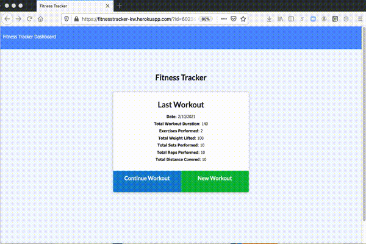

# FitnessTracker

The FitnessTrakcer application utilizes a mongo database and mongoose to allow users to workouts and track cardio and resistence excercises into a database that the user can view in a dashboard to track duration and weight lifted over the past 7 workouts. 

[Fitness tracker application can be found on github repository ](https://github.com/ktywelch/FitnessTracker)

## Table of contents
* [Design](#Design)
* [Installation](#Installation)
* [Usage](#Usage)
* [Technologies](#Technologies)
* [Contributions](#Contributions)
* [License](#License)

## Design
The design utilizes a server, controllers, DB and  express  to create a web site that will  allow the user to track workouts in a database and add exercises to an existing workout until completed.

The application is deployed on [Heroku at fitnesstracker-kw.herokuapp.com](https://fitnesstracker-kw.herokuapp.com).

## Database:

Is is NoSQL DB that utilizes a collection with a date and an array to trace the exercises associated with each workout. 


## Installation
Assumptions prior to installation that the user has installed MongoDB community edition and installed and is familiar with starting MongoDB services. For additional details on install MySQL and tools please refer to the [MongoDB Community Edition site.](https://www.mongodb.com/try/download/community) 

The installation process is a download of git source, using npm install to install required modules based on the package.json file included in the same directory as the application.

The application has a seed.js that is used to populate test data and create the DB using the model. To execute the seed the user can run:
```npm run seed```

## Usage
To start the application run:

```node server.js```
    or 
``` npm start ```

Below is  gif image of the user interface.




## Technologies
* MongoDB NoSQL Database Server
* Robo 3T
* Node.js
* NPM modules express, mongoose, router, views, bootstrap & HTML

## Contributions - Study peers
* Sam Ayler
* Vincent Gines
* Albert Cheng
* Lucah Endicott

## License
ISC License (ISC)


Permission to use, copy, modify, and/or distribute this software for any purpose with or without fee is hereby granted, provided that the above copyright notice and this permission notice appear in all copies.

THE SOFTWARE IS PROVIDED "AS IS" AND THE AUTHOR DISCLAIMS ALL WARRANTIES WITH REGARD TO THIS SOFTWARE INCLUDING ALL IMPLIED WARRANTIES OF MERCHANTABILITY AND FITNESS. IN NO EVENT SHALL THE AUTHOR BE LIABLE FOR ANY SPECIAL, DIRECT, INDIRECT, OR CONSEQUENTIAL DAMAGES OR ANY DAMAGES WHATSOEVER RESULTING FROM LOSS OF USE, DATA OR PROFITS, WHETHER IN AN ACTION OF CONTRACT, NEGLIGENCE OR OTHER TORTIOUS ACTION, ARISING OUT OF OR IN CONNECTION WITH THE USE OR PERFORMANCE OF THIS SOFTWARE.
